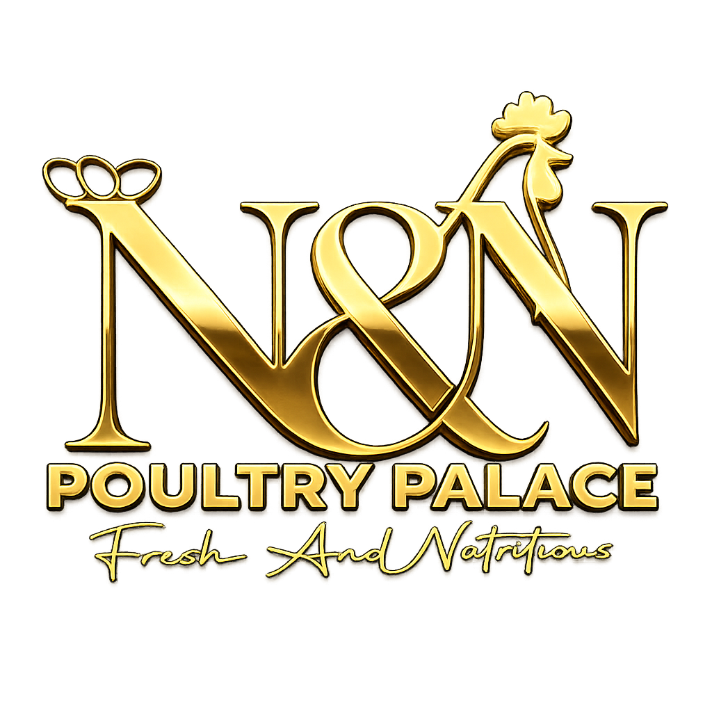

# N&N Poultry Palace

A modern, CMS-driven React web application featuring a premium gold-on-black design with GSAP animations.



## Features

- 🎨 **Premium Gold-on-Black Design** - Luxurious aesthetic with careful attention to detail
- 📱 **Fully Responsive** - Optimized for all devices
- ✨ **GSAP Animations** - Smooth scroll-triggered animations
- 📝 **CMS-Driven Content** - Easy-to-update content files
- 🎓 **Educational Hub** - Comprehensive guides on chicken manure and sustainable farming
- 🛒 **Order Form** - Complete order placement system
- ♿ **Accessible** - WCAG AA compliant
- ⚡ **Performance Optimized** - Fast load times and smooth interactions

## Tech Stack

- React 18 + TypeScript
- Vite
- Tailwind CSS
- shadcn/ui
- GSAP
- Lucide React

## Quick Start

```bash
# Install dependencies
npm install

# Start development server
npm run dev

# Build for production
npm run build
```

## Project Structure

```
src/
├── cms/              # Content files (edit these!)
├── components/       # React components
├── hooks/            # Custom hooks
├── types/            # TypeScript types
└── ...
```

## CMS Content

Edit these files to update site content:

- `src/cms/products.ts` - Product information
- `src/cms/educational.ts` - Educational articles
- `src/cms/settings.ts` - Site settings, contact info, testimonials

## Documentation

See [HANDOFF_DOCUMENTATION.md](../HANDOFF_DOCUMENTATION.md) for complete documentation.

## License

Proprietary - N&N Poultry Palace Limited
